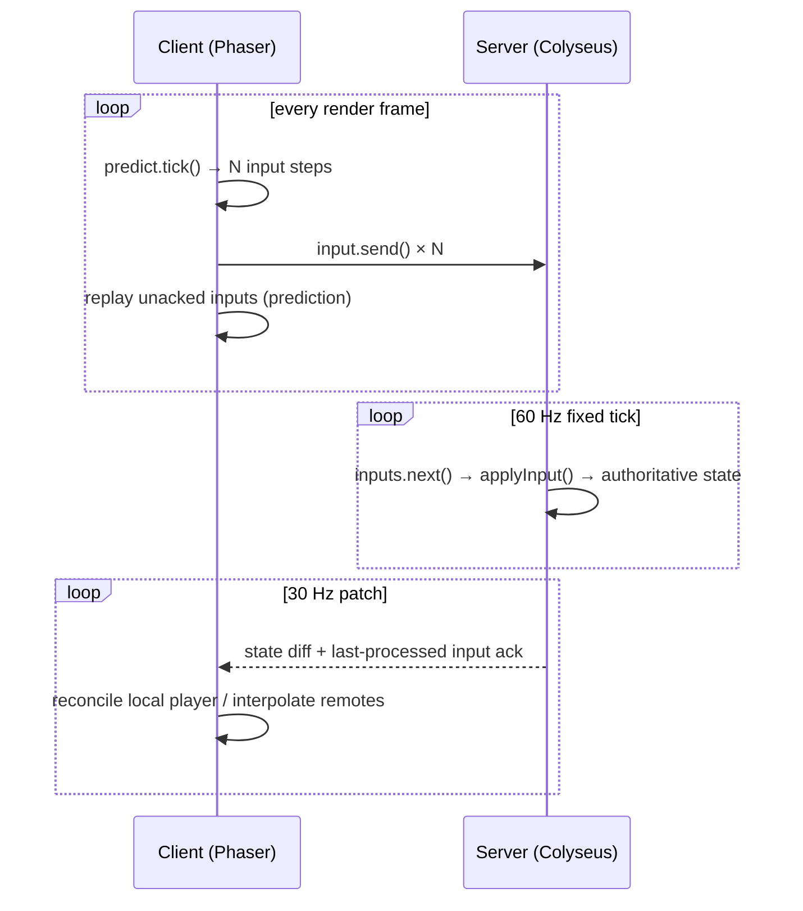

# Colyseus + Phaser Multiplayer Starter

A minimal 2D multiplayer example built with **Colyseus 0.18** on the server and
**Phaser 4** on the client. It demonstrates a production-shaped netcode setup:

- **Server-authoritative simulation** at a fixed 60 Hz tick.
- **Buffered inputs** (`defineInput` / `room.input`) with a 30 Hz state broadcast.
- **Client-side prediction + reconciliation** for the local player (`Predict`).
- **Interpolated remote players** with a configurable render delay.
- **Virtual joystick + keyboard** controls, working on desktop and touch devices.
- **On-screen lag diagnostics** (RTT, jitter, pending inputs, FPS, prediction lead).

---

## Requirements

| Tool | Version |
| --- | --- |
| Node.js | `>= 22` (server `engines`) |
| npm | any recent version |

---

## Getting started (local)

Clone and install both packages:

```bash
git clone git@github.com:htetoowai219/learning-colyseus-and-phaser.git
cd learning-colyseus-and-phaser

# install server + client dependencies
cd server && npm install
cd ../client && npm install
```

Run the two processes in **separate terminals**:

```bash
# Terminal 1 — game server (ws://localhost:2567)
cd server
npm start
```

```bash
# Terminal 2 — client dev server (http://localhost:1234)
cd client
npm start
```

Open <http://localhost:1234> in your browser. Open it in several tabs or on
several devices to see players join the same room (up to 4).

### Controls

- **Arrow keys** on desktop.
- **Virtual joystick** (bottom-left) on any device.
- Move to see your sprite and the other players in real time.

---

## Playing from a phone or another device (LAN)

1. Find the host machine's LAN IP (e.g. `192.168.1.19`).
2. On the phone, open `http://<LAN-IP>:1234`.
3. The client automatically connects to the game server on the **same host**
   (`http://${window.location.hostname}:2567`), so no configuration is needed.

Make sure:

- Phone and host are on the **same network / subnet**.
- The host firewall allows inbound **1234** (Parcel) and **2567** (Colyseus).
- Prefer **5 GHz Wi-Fi** for the handhelds, and **Ethernet** for the host if
  possible — this removes a wireless hop and dramatically reduces latency.

> The client dev server binds to all interfaces by default; do **not** pass
> `--host 0.0.0.0` to Parcel — it breaks hot reload for the LAN workflow.

---

## Configuration

### Server environment variables

| Variable | Default | Description |
| --- | --- | --- |
| `PORT` | `2567` | HTTP/WebSocket port the server listens on. |
| `COLYSEUS_LATENCY` | `0` (off) | Artificial one-way latency in ms for testing `simulateLatency`. Off by default so local/LAN tests use the real network. Try `COLYSEUS_LATENCY=200 npm start`. |

```bash
# example: simulate a 200 ms laggy connection
COLYSEUS_LATENCY=200 npm start
```

### Room URL flags (client)

| Flag | Default | Description |
| --- | --- | --- |
| `?remote=extrapolate` | `lerp` | How remote players are rendered. `lerp` smoothly interpolates between snapshots; `extrapolate` projects them forward from their last velocity (hides latency, may overshoot). |

```text
http://192.168.1.19:1234/?remote=extrapolate
```

---

## How it works



- **Server authority.** All movement happens on the server inside a fixed
  timestep (`setFixedTimestep(..., 60)`), so every client sees the same world.
  The deterministic step lives in `shared/applyInput.ts` and is used by **both**
  client and server.
- **Buffered input.** `this.defineInput(MoveInput, { bufferMaxSize: 64 })`
  declares the input schema. Each tick consumes exactly one input via
  `inputs.get(sessionId).next()`, which keeps the acknowledgement count aligned
  with what was actually simulated.
- **Prediction + reconciliation.** The client predicts ahead locally and, on each
  server patch, replays its unacknowledged inputs against the authoritative
  snapshot (`Predict` reconciler). This makes the **local** player feel instant
  even on a laggy connection.
- **Remote interpolation.** Other players are rendered slightly in the past and
  smoothed between snapshots (`delay: 70 ms`) to hide network jitter.
- **Patch rate.** The server broadcasts state at 30 Hz (the input ack rides the
  patch). This trades a small amount of bandwidth for fresher snapshots and lower
  end-to-end latency.

---

## Debug overlay

The top-left overlay shows live connection quality:

```text
RTT 45ms (last 52)  jitter 2.1ms
pending 3  tick 60Hz  patch 33ms
fps 60
mode lerp  lead ~6px
```

| Field | Meaning |
| --- | --- |
| **RTT** | Round-trip time to the server (smoothed / last sample). Includes up to one patch interval of quantization, so it reads ~25–40 ms even on loopback. |
| **jitter** | Variation in RTT — the main cause of "stutter". |
| **pending** | Inputs sent but not yet acknowledged. The local prediction lead ≈ `pending × speed / tickRate`. |
| **tick / patch** | Server simulation rate and broadcast interval. |
| **fps** | Client render rate — tells device performance apart from network issues. |
| **mode / lead** | Remote render mode and the approximate pixel gap between the predicted sprite and the last server-acknowledged position. |

---

## Project structure

```text
.
├── client/                     # Phaser 4 front-end (Parcel)
│   ├── index.ts                # GameScene: prediction, input, rendering, debug overlay
│   ├── index.html
│   ├── components/
│   │   └── VirtualJoystick.ts
│   ├── shared/                 # input schema + movement step  (KEEP IN SYNC)
│   └── types/types.ts
└── server/                     # Colyseus 0.18 server
    ├── src/index.ts            # entry point (listen)
    ├── src/app.config.ts       # rooms, routes, artificial latency
    ├── src/rooms/MyRoom.ts     # authoritative room + fixed timestep
    ├── src/rooms/schema/MyRoomState.ts
    └── src/shared/             # input schema + movement step  (KEEP IN SYNC)
```

> **Important:** `MoveInput.ts` and `applyInput.ts` are intentionally duplicated
> under `client/shared/` and `server/src/shared/`. They must stay identical so
> prediction matches server simulation exactly. When you change one, change both.

---

## Scripts

### Server (`server/`)

| Command | Description |
| --- | --- |
| `npm start` | Run the server in watch mode (`tsx watch src/index.ts`). |
| `npm test` | Run the mocha test suite. |
| `npm run build` | Compile to `build/` (`tsc -p tsconfig.build.json`). |
| `npm run loadtest` | Connect N simulated clients via `@colyseus/loadtest`. |

### Client (`client/`)

| Command | Description |
| --- | --- |
| `npm start` | Start the Parcel dev server on port `1234`. |
| `npx parcel build index.html` | Production build into `dist/`. |

### Useful endpoints (non-production)

| URL | Description |
| --- | --- |
| `http://localhost:2567` | Colyseus playground |
| `http://localhost:2567/monitor` | Room monitor (`@colyseus/monitor`) |
| `http://localhost:2567/hi` | Example Express route |
| `http://localhost:2567/api/hello` | Example Colyseus router endpoint |

---

## Troubleshooting

- **Phone can't connect.** Confirm it is on the same subnet, open firewall ports
  **1234** and **2567**, and use the host's LAN IP (not `localhost`).
- **Laggy on Wi-Fi.** Check the overlay: high RTT/jitter indicates the network,
  not the code. Use 5 GHz, disable Wi-Fi power saving, and wire the host via
  Ethernet.
- **Need to test bad connections.** Start the server with `COLYSEUS_LATENCY=200`.
- **Types fail after editing shared code.** Run `npx tsc --noEmit` inside
  `client/` and `server/`.

---

## License

`server/` is marked `UNLICENSED`; `client/` is `ISC`. Update these fields before
publishing or redistributing.
